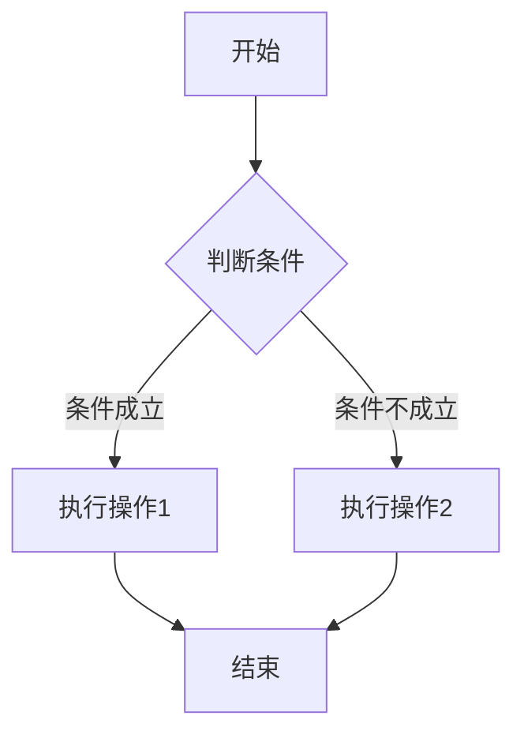

<!-- [建议补充] 内容较零散，后续可按主题拆分成独立文章 -->

## AI 相关想法

1. MMA + SRA
2. 聚合个人知识库
3. 整合米家操控（类似小爱但是更智能）

## 读书笔记

鼓励需要同理心，而且是从配偶的观点，去看这个世界。我们必须先学习，对我们的配偶来说，什么才是最重要的。

爱是不保存犯错的记录；爱是不提过去的失败。

## Golang 学习路线参考

### 一些问题

- 闭包？

### 学习路线

1. **入门阶段（1-2 周）**：先搞定语法和核心概念
   - 首选官方文档（Tour of Go），交互式学习
   - 搭配入门书，比如《Go 语言编程之旅》
   - 先能独立写一个简单 HTTP 接口或文件读写脚本

2. **进阶阶段（2-4 周）**：聚焦 Go 的核心特性
   - 重点学 goroutine、channel、sync 包
   - 推荐看《Go 并发编程实战》，配合官方的《Effective Go》文档
   - 动手练：并发爬虫、简单的缓存服务
   - 学习工具链：`go vet`、`pprof`

3. **实战阶段（1 个月+）**：用项目驱动学习
   - 从工具类项目开始：命令行工具、基于 Gin/Echo 的 RESTful API
   - 深入：消息队列客户端（RabbitMQ/Kafka）、基于 gorm 的数据 CRUD 服务

## SQL 调优

**核心目标：减少数据库的 IO/CPU/内存消耗、缩短执行路径、提升资源利用率。**

## 影视清单

### 电影

- [x] 8 月 2 日 浪浪山小妖怪
- [ ] 11 月 7 日 小林家的龙丫头：怕寂寞的龙
- [ ] 11 月 14 日 惊天魔盗团 3
- [ ] 11 月 26 日 疯狂动物城 2

### 动漫

- [x] 26-1 月 葬送的芙莉莲第二季

### 电视剧

- [ ] 25-10 月 一点点超能力
- [x] 命悬一生
- [x] 回魂计
- [x] 四喜
- [ ] 台风商社
- [ ] 亲爱的X
- [ ] 灵指
- [ ] 三人行

## 换绑 TODO

- [ ] TG
- [ ] 各类游戏
- [ ] 飞书
- [ ] deepseek

## AI 测试题

我想去洗车，洗车店距离我家 50 米，你说我应该开车过去还是走过去？

> 当然是开车过去——因为车也要洗。

## 链接收藏

- `CF Worker` 短链：<https://github.com/ccbikai/sink>
- NodeQuality：`bash <(curl -sL https://run.NodeQuality.com)`
- [服务器磁盘排查工具](https://googhub.nyc.mn/posts/2025/%E6%9C%8D%E5%8A%A1%E5%99%A8%E7%A3%81%E7%9B%98%E6%8E%92%E6%9F%A5%E5%B7%A5%E5%85%B7%E7%BB%88%E6%9E%81%E6%8C%87%E5%8D%97%E9%9D%9E%E8%BF%90%E7%BB%B4%E4%B9%9F%E8%83%BD%E8%BD%BB%E6%9D%BE%E6%90%9E%E5%AE%9A%E7%A3%81%E7%9B%98%E9%97%AE%E9%A2%98)

## 号卡相关

### 业务开通

[重庆 10 元 100G](https://u.10010.cn/qbeBQ)

### 羊毛抽奖

[联通话费流量抽奖](https://byte.wo.cn/fun/sydhk/draw?id=13)

```
1、先打开 https://backward.bol.wo.cn/market#/ 登录，这个页面 100% 可以登录
2、再打开这个网页就行了 https://backward.bol.wo.cn/market-act/luckDraw
```

### 领奖链接

- [异性包权益](https://byte.wo.cn/dly/p/rightsMenu.html)
- [联通云守护](https://h5forphone.wostore.cn/pc/PCLogin3New.html)

## 3x-ui 代理面板

<https://hub.docker.com/r/bigbugcc/3x-ui>

默认账号密码：admin/admin

测速：<https://github.com/wikihost-opensource/als>

```yaml
- name: vless
  type: vless
  server: xxx
  port: 50443 # 尽量用大一点，不然可能 timeout
  uuid: xxx
  network: tcp
  tls: true
  udp: true
  flow: xtls-rprx-vision
  servername: gpuopen.com
  reality-opts:
    public-key: xxx
    short-id: xxx
  client-fingerprint: chrome
```

## Docker 容器限速

> 下面的方案貌似都不行，链接没成功

<https://www.cnblogs.com/JacobX/p/18908334>

```bash
# 查看接口的队列规则
tc -s qdisc show dev enp0s31f6

# 查看类配置
tc -s class show dev enp0s31f6

# 查看过滤器配置
tc -s filter show dev enp0s31f6
```

```bash
#!/bin/bash

# 定义要限制的网络接口和 IP 地址
INTERFACE="enp0s31f6"
TARGET_IP="192.168.31.2"

# 清除该接口上的所有现有流量控制配置
tc qdisc del dev $INTERFACE root 2> /dev/null

# 创建一个 HTB 队列规则作为根队列
tc qdisc add dev $INTERFACE root handle 1: htb default 10

# 创建主类，分配总带宽
tc class add dev $INTERFACE parent 1: classid 1:1 htb rate 10000mbit

# 创建受限类，为目标 IP 分配有限带宽
tc class add dev $INTERFACE parent 1:1 classid 1:10 htb rate 10mbit ceil 15mbit

# 添加过滤器，将目标 IP 的流量导向受限类
tc filter add dev $INTERFACE protocol ip parent 1:0 prio 1 u32 match ip src $TARGET_IP flowid 1:10

echo "已限制 IP $TARGET_IP 的带宽为 10Mbit/s，峰值 15Mbit/s"
```

## Clash 订阅转换

```bash
# Sub-Store
docker run -it -d --restart=always \
-e "SUB_STORE_BACKEND_SYNC_CRON=55 23 * * *" \
-e SUB_STORE_FRONTEND_BACKEND_PATH=/xxx \
-p 3001:3001 -v /vol1/1000/docker/sub-store:/opt/app/data --name sub-store xream/sub-store

# subconverter
docker run -d --name subcon --restart=always -p 25500:25500 tindy2013/subconverter:latest
```

## Dockerfile 基础

| 指令 | 示例 | 说明 |
| --- | --- | --- |
| `FROM` | `FROM nginx` | 使用 `nginx` 作为基础镜像 |

## 工作笔记：活动配置及模块分层优化

- 后台活动、本地配置仅仅配置来源不一样，通过子模块区分读取配置逻辑即可
- 插件添加本模块对于活动类型函数，用于查找活动对应配置子模块
- 后台活动的配置可以放到 `ets_activity` 中，启动服务器的时候自动 `preload + parse_conf`

## WSL2 无法启动

`无法将磁盘"C:\Program Files\WSL\system.vhd"附加到 WSL2`

下载安装包重新安装 `wsl`：<https://github.com/microsoft/WSL/releases>

貌似重启一下就好了...

## Minecraft 相关链接

- 「`Minecraft` 控制面板」`MCSManager`：<https://docs.mcsmanager.com/zh_cn/>
- 「控制服务器的 `Python` 工具」`MCDReforged`：<https://mcdreforged.com/zh-CN>
- 「服务端」`Mohist`：<https://mohistmc.cn/>
- 「权限管理 mod」`LuckPerms`：<https://www.mcmod.cn/class/5192.html>

### 宝可梦重铸

- [Wiki](https://pixelmonmod.com/)

## Memos 注意事项

1. 遇到复制的 Markdown 表格无法生成的问题：最后一列的 `|` 后面不能有多余空格

## Memos 流程图语法

### 常用节点类型

| 语法格式 | 节点样式 | 用途 |
| --- | --- | --- |
| `A[文本]` | 矩形 | 表示步骤/操作 |
| `A(文本)` | 圆形 | 表示开始/结束 |
| `A{文本}` | 菱形 | 表示判断/分支 |
| `A>文本]` | 不对称矩形 | 表示输入/输出 |
| `A[[文本]]` | 双矩形 | 表示子流程/子程序 |

### 常用连线类型

| 语法 | 含义 | 示例 |
| --- | --- | --- |
| `-->` | 普通连线 | `A --> B` |
| `--\|文本\|-->` | 带标签的连线 | `A --\|是\|--> B` |
| `==>` | 加粗连线 | `A ==> B` |
| `-.->` | 虚线连线 | `A -.-> B` |

### 基础示例



## Erlang LSP 配置补充

```yaml
# 进入 erlang shell 查看文件位置
# filename:basedir(user_config, "erlang_ls").
# https://erlang-ls.github.io/configuration/

# erlang_ls.config
providers:
  disabled:
    - document-formatting # 关闭自动格式化
```

## Claude Code 安装

> 建议选择 npm 安装方式，建议不使用 MCP 直接使用插件，功能更强大

```bash
apt install unzip curl git xdg-utils -y
curl -fsSL https://fnm.vercel.app/install | bash
source ~/.bashrc
fnm install --lts
npx zcf # 开始安装 Claude Code
```

```bash
/plugin marketplace add anthropics/claude-code # 官方插件市场
/plugin marketplace add anthropics/skills # 安装 Skills
```
